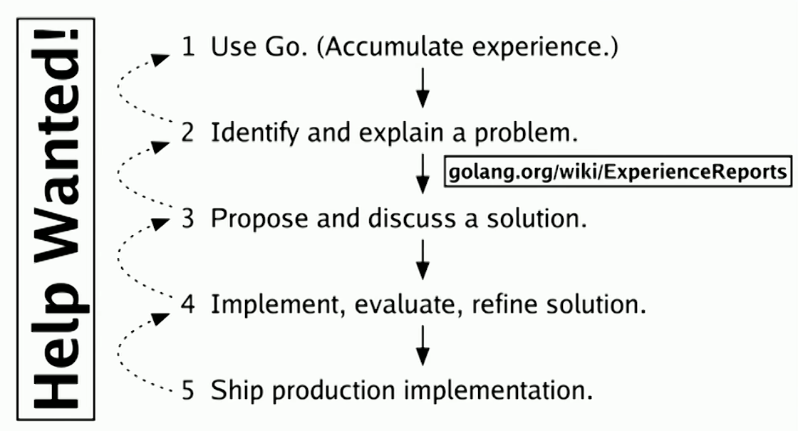
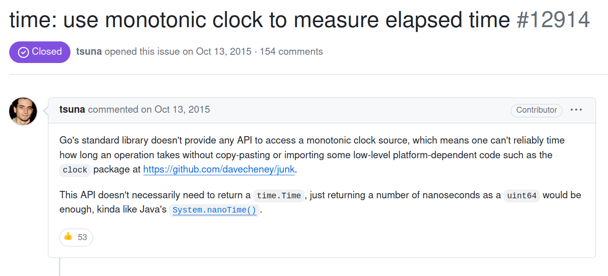
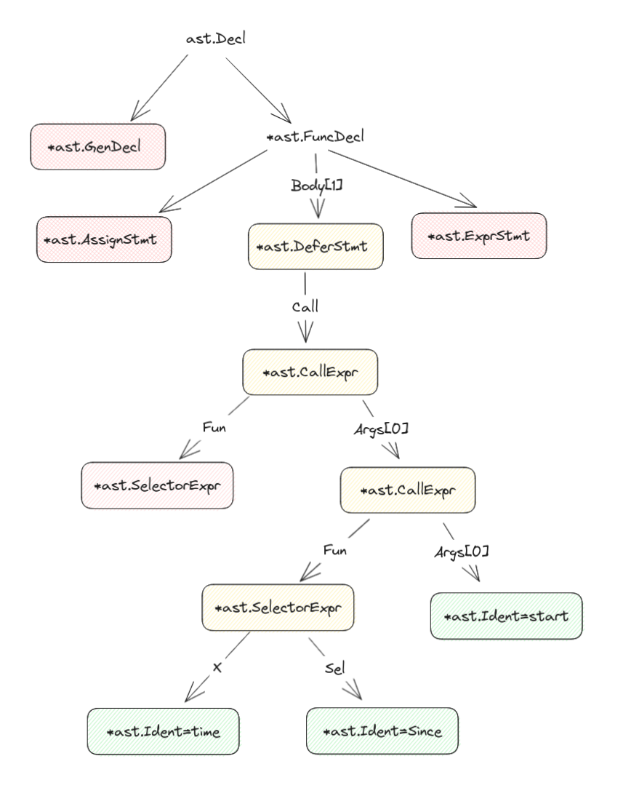
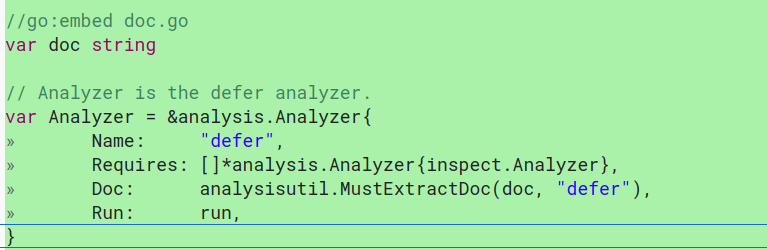
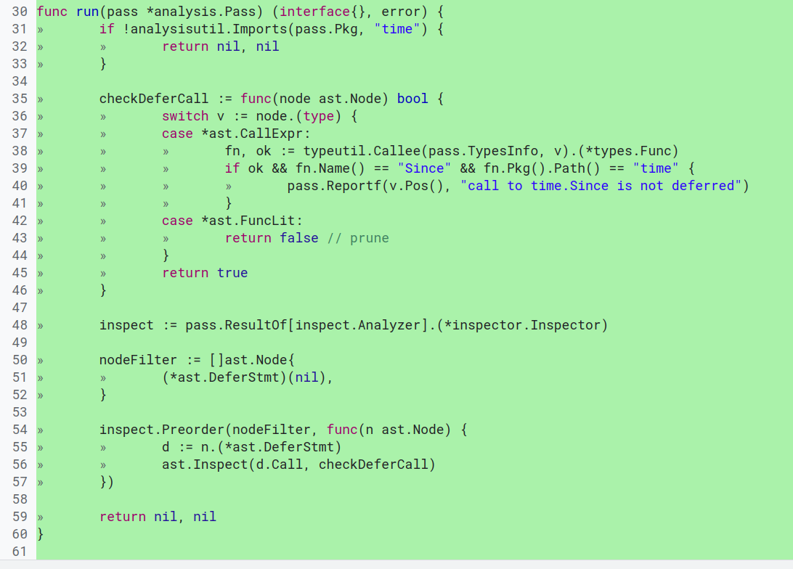

# Adding an analyzer to vet

## From bug to upstream

(also, happy pi day - i snuck in some references!)

---

## What does this print?

    func main() {
        start := time.Now()
        defer fmt.Println(time.Since(start))
        time.Sleep(3.14 * time.Second)
    }

---

# Part 1 - The Bug

Our production systems have the lowest bucket of latency! _Hooray!_
Or maybe not...

> These raspberry pi's are FAST!
> <insert xkcd thinking face>

---

# What should we do about this

* Fix the bug where we noticed it>
    * ... then we found another place that had this bug.
* Do a regex and fix it in our mono-repo.
    * ... but that doesn’t stop somebody \(me\) from writing the bug again.
* Perform static analysis to detect this before check in.
    * ... and if we can get it in go vet\, it’ll _just work_ for everybody.

---

## Part two: merging upstream

From [Russ Cox's talk on the proposal process](https://www.youtube.com/watch?v=0Zbh_vmAKvk).

---

## Story: Before Go’s proposal process

* A small outage at cloud-flare was caused because the go team was slow to realize that an issue had real broad impact.
* I included this because the author is at Arista, which is where this talk was originally given.

---

## Boring Admin (Contributor Guide / Proposal)

### [Contributor Guide](https://go.dev/doc/contribute#contributor) TLDR:

* Accept the Contributor License Agreement
* Register for Gerrit
* Use the tool they have for Gerrit if you're not already used to it.

### [golang/proposal](https://github.com/golang/proposal#readme) TLDR:

* Create a brief issue
* That gets triaged as :\<accepted\, declined\, requires design doc>
* Not everything needs a proposal\, but look at the guidelines in the Github.

---

## The Bug

> cmd/vet: time.Since should not be used in defer statement #60048

This really was a simple case:

* The bug is very self-explanatory
* The impact on production systems is obvious; I even found examples in google code
* My suggested approach, the analyzer, is the right place to solve this problem

It might be harder to upstream fixes for more complex issues, but don’t let that stop you!

---

## Part three: Static analysis

---

## The analysis package

* Analysis tooling breaks analysis steps into individual modules
* A module can report errors, but can also store data structure \(facts\) for reuse
  * We don’t need to repeat tokenization, etc.
* An analysis pass declares its dependencies by adding Requires.
* In practice in x/tools, everything just depends on inspect.Analyzer, which provides efficient AST traversal.

---

## Walkthrough

Inspect is the previously exported fact to let us view the AST.
We select defer statements using the Inspect func, then break into our own walk over the AST.

* Note: there is a lot of context here missing that I provided verbally during the talk.
* I won't repeat that here, for now.
